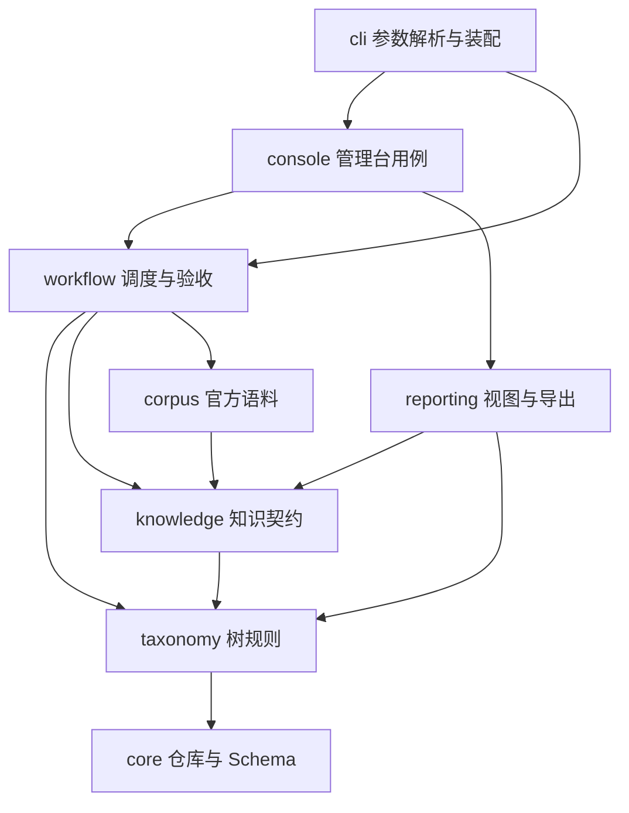

# FeatureTree 代码地图

## 先分清四类目录

| 类别 | 路径 | 地位与维护方式 |
| --- | --- | --- |
| 当前源码与规则 | `featuretree/`、`web/src/`、`.opencode/agents/`、`config/`、`docs/` | 当前运行实现；修改后做回归 |
| 当前数据与研究资料 | `taxonomy/`、`knowledge/`、`docs-raw/` | 树、知识与证据输入；不能当构建缓存清理 |
| 运行记录与生成物 | `.workflow/`、`output/`、`web/dist/` | `.workflow/` 负责恢复和审计，需保留；`output/` 和 `web/dist/` 可重建 |
| 历史与工具环境 | `archive/`、`.venv/`、`web/node_modules/` | 归档不参与执行；后两者是依赖环境，不是项目业务代码 |

当前主线是树设计与节点分析。知识正文尚未批量生产，但知识空壳、证据和置信度契约已被管理台读取和发布流程使用。因此“暂不生产正文”不表示 `featuretree/knowledge/` 可以删掉。

## 目录层级

```text
FeatureTree/
├── featuretree/               Python 后端
│   ├── __main__.py            python -m featuretree
│   ├── cli/                   命令解析与依赖装配
│   ├── console/               HTTP、任务用例、后台启动与展示
│   ├── workflow/              节点工作流
│   │   └── backends/          执行接口、OpenCode、进程与诊断
│   ├── taxonomy/              树结构与节点规则
│   ├── knowledge/             比较、置信度、证据与知识空壳
│   ├── corpus/                官方语料下载、索引、检索
│   ├── reporting/             视图、导出、复核清单和质量报告
│   └── core/                  仓库 IO、路径、Schema
├── web/src/
│   ├── main.jsx               浏览器入口
│   ├── app/                   页面装配、导航、全局样式
│   ├── features/
│   │   ├── tree/              特性树、节点详情、筛选与图
│   │   │   └── details/       节点详情各面板
│   │   ├── knowledge/         知识检索与结果页
│   │   └── workflow/          发起分析、任务列表与阶段结果
│   └── shared/                格式化、质量筛选与共享组件
├── scripts/                   保留既有命令名称的薄入口
├── tests/
│   ├── backend/               按模块组织的 Python 回归
│   ├── frontend/              前端数据逻辑测试
│   └── fixtures/              合成数据、模型替身与隔离服务
├── .opencode/agents/          7 个标准 Agent 定义
├── config/                    数据 Schema、工作流契约、研究规则
├── docs/                      architecture / workflow / taxonomy / corpus / knowledge
├── taxonomy/                  正式特性树
├── knowledge/                 正式知识与待生产空壳
├── docs-raw/                  原始官方资料及语料索引
├── .workflow/                 可恢复的新工作流运行记录
├── output/                    导出、报告与测试截图
└── archive/                   旧树、旧批次与旧实现
```

## 日常只需要记住一个命令入口

```bash
.venv/bin/python -m featuretree --help
.venv/bin/python -m featuretree console
.venv/bin/python -m featuretree workflow --help
.venv/bin/python -m featuretree corpus --help
```

| 子命令 | 使用场景 | 对应旧入口（继续可用） |
| --- | --- | --- |
| `console` | 启动管理台 | `scripts/serve_viewer.py` |
| `workflow` | 节点计划、执行、恢复、审查后发布 | `scripts/workflow.py` |
| `corpus` | 官方语料下载、检索、读正文 | `scripts/official_docs.py` |
| `lint` | 检查树层级、命名、边界 | `scripts/tree_lint.py` |
| `anchors` | 官方语料锚点检测，`--write` 显式回写 | `scripts/verify_anchors.py` |
| `refresh` | 补缺失知识空壳、导出、校验 | `scripts/refresh.py` |
| `audit` | 数据完整性与知识确认进度报告 | `scripts/audit_coverage.py` |
| `design-inputs` | 导出现有领域定义供设计阅读 | `scripts/export_design_inputs.py` |
| `review-scope` | 按置信度与预算选取待复核项 | `scripts/export_review_scope.py` |
| `evidence` | 导出不可变官方证据快照 | `scripts/export_research_sources.py` |

`audit` 的完整性与知识确认统计不代表树覆盖完成。`review-scope` 只导出范围；触发执行用 `workflow` 或管理台。

## 后端边界与依赖方向



图展示主要调用链。上层可以使用 `core`；`console` 可以直接使用树和知识校验；所有包禁止反向依赖命令入口。确切允许关系由 [架构测试](../../tests/backend/test_architecture.py) 检查，同时检查模块循环和测试样例依赖。

| 模块 | 职责 | 不承担 |
| --- | --- | --- |
| `cli/` | 参数解析；选择具体服务和 OpenCode 后端 | 树算法、验收规则、候选合并 |
| `console/` | HTTP 校验、建单幂等、运行容量、节点选取、任务投影、进程启动 | 平台能力判断、直接绕过发布器写树 |
| `workflow/` | 固定工作单、并行 DAG、阶段契约、验收、恢复、发布 | HTTP/UI、知识正文生产 |
| `taxonomy/` | 结构/粒度检查、父子遍历、绑定与节点构造 | 模型调用、服务生命周期 |
| `knowledge/` | 空壳、支持比较、置信度、证据和来源适用性规则 | 批次调度、未经证据确认能力 |
| `corpus/` | 保存/获取官方资料、全文检索、上下文与证据快照 | 从未检索到资料推导“不支持” |
| `reporting/` | 纯视图投影和显式导出、质量报告 | 启动模型、发布树候选 |
| `core/` | 安全路径、原子文件写入、仓库读取、Schema 加载 | 领域判断和上层服务依赖 |

## 一次节点分析应该怎么读代码

1. 前端 `features/workflow/AnalysisDialog.jsx` 收集范围；`useWorkflow.js` 调用接口并跟踪任务。
2. `console/server.py` 路由 → `api.py` 请求检查 → `service.py` 建单和容量控制。
3. `console/launcher.py` 启动独立协调器 → `cli/workflow.py` 注入 OpenCode 实现。
4. `workflow/planning.py` 固定树与基线；`packets.py` 组装各阶段输入；`engine.py` 调度 DAG。
5. `backends/base.py` 定义执行接口；`backends/opencode.py` 实现传输；`contracts.py`、`gates.py`、`sources.py` 分别检查输出格式、树规则和锚点。
6. `recovery.py` 管理重试与定向返工；`publication.py` 复核产物并事务式合入；`state.py` 管理指纹、锁和持久化状态。
7. `console/runs.py` 生成可展示的任务信息，前端 `RunDetails.jsx` 和 `StageResult.jsx` 展示结果。

树页面走另一条只读路径：`console/snapshot.py` → `reporting/views.py` → 树与知识校验；渲染不会启动分析。

## 旧文件去哪里了

| 原文件/目录 | 新位置 |
| --- | --- |
| `featuretree/storage.py`、`paths.py` | `core/storage.py`、`core/paths.py` |
| `featuretree/validation.py` | Schema 加载 → `core/schemas.py`；树关系 → `taxonomy/validation.py` |
| `taxonomy_authoring.py`、`tree_structure.py`、`bindings.py` | `taxonomy/authoring.py`、`structure.py`、`bindings.py` |
| `comparison.py`、`confidence*.py`、`evidence.py`、`research_profile.py`、`source_policy.py` | `knowledge/` 对应模块 |
| `generation.py` | 空壳初始化 → `knowledge/initialization.py`；纯投影 → `reporting/views.py`；写导出 → `reporting/exports.py` |
| `audit.py`、`review_scope.py` | 业务 → `reporting/audit.py`、`review.py`；参数解析 → `cli/` |
| `research_sources.py` | 证据业务 → `corpus/evidence.py`；参数解析 → `cli/evidence.py` |
| `viewer.py`、`viewer_server.py`、`viewer_workflow.py` | `console/snapshot.py`、`server.py`、`api.py` |
| `workflow/console_*.py` | `console/service.py`、`runs.py`、`launcher.py` |
| `workflow/common.py` | 阶段定义 → `stages.py`；运行状态 → `state.py`；遍历 → `taxonomy/traversal.py` |
| `workflow/engine.py` | 调度留在 `engine.py`；工作包 → `packets.py`；重试返工 → `recovery.py` |
| `workflow/opencode.py`、`processes.py` | `workflow/backends/` |
| `web/*.js` 中的数据逻辑和 `web/src/` 平铺组件 | `features/tree/`、`features/knowledge/`、`features/workflow/`、`shared/` |
| `tests/test_*.py`、跨测试引用的样例 | `tests/backend/`、`tests/fixtures/` |

Python 内部导入统一使用新包路径，不保留重复转发模块。对外的脚本名称、HTTP 路径、前端功能、数据目录与运行记录格式保持兼容。规则与实现指纹会变化，已有任务保留可查；需新建任务使用重构后的规则。

移除了没有当前调用方、测试或文档引用的旧 `merge_bindings`、`pending`、`write_domain` 辅助函数。节点构造保留为纯计算；候选写入正式树通过工作流发布器完成。归档内容保持原样。

## 后续新增代码放哪

- 新增 Agent 或阶段：`.opencode/agents/`、`config/workflow/` 和 `workflow/`；界面参数放 `features/workflow/`。
- 新增校验：先区分树规则、知识证据规则、工作流验收，再放入对应包；不能写进 HTTP handler。
- 新增官方资料接入：`corpus/`；来源适用性规则属于 `knowledge/source_policy.py`。
- 新增报表：投影与导出放 `reporting/`，参数放 `cli/`；不在 `scripts/` 写业务。
- 新增前端页面：放在 `features/<功能>/`；真正跨功能使用的组件才放 `shared/`。
- 新增样例：放 `tests/fixtures/`；测试不得依赖别的测试套件，也不得读归档作为当前数据。

验证入口：`.venv/bin/python -m unittest discover -s tests -q`、`npm --prefix web test`、`npm --prefix web run build`。架构测试约束依赖方向；功能测试验证计划、执行、返工、发布和 HTTP；前端测试校验数据模型与详情渲染。
