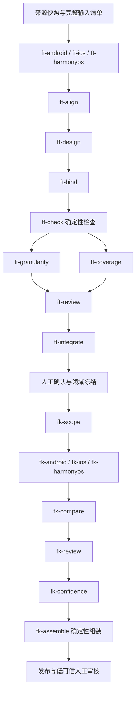

# v2 工作流与交付

协议为 v2，树/知识/评级业务契约为 v3，发布清单单独使用 v1。执行器只接受注册 Schema，不解释归档 v1 工作单。

| Agent | 固定交付 | 边界/返工责任 |
|---|---|---|
| ft-android | Android 事实卡、API/主题逐项处置 | 单端事实，不能设计公共树 |
| ft-ios | iOS 同契约事实卡 | 同上 |
| ft-harmonyos | HarmonyOS 同契约事实卡 | 同上，区分 OpenHarmony |
| ft-align | 功能对应、差异、未匹配事实 | 不按名字相似直接合并 |
| ft-design | 骨架、细化或结构修订之一 | 候选 ID；不发布、不做最终绑定 |
| ft-bind | 逐 API 用途、核心/辅助角色、实现路线 | 不改节点边界 |
| ft-granularity | 每叶粒度判定与建议 | 消费代码计数，不填写权威规模 |
| ft-coverage | 遗漏、未决输入与责任阶段 | 不替生成者补答案 |
| ft-review | 独立局部审查和返工单 | 不改作者产物 |
| ft-integrate | 跨域边界审查与冻结建议 | 不发布 |
| fk-scope | 必答问题、范围、条件与成功标准 | 不预判平台支持 |
| fk-android | Android 逐题结论与依据 | 不跨端推论 |
| fk-ios | iOS 同契约结论 | 同上 |
| fk-harmonyos | HarmonyOS 同契约结论 | 同上 |
| fk-compare | 能力结果与 API 形态分别比较 | 引用两端前提，不改平台事实 |
| fk-review | 每个固定结论的独立审查 | 已知错误返工 |
| fk-confidence | 每项高中低、理由与缺口 | 回传结论哈希和评级输入指纹，不填整体评级 |

每个交付含 protocol_version、run_id、work_id、task_id、stage_id、input_hash、outcome、payload、issues、source_requests。完整 JSON 示例由测试替身生成到临时运行目录；契约权威定义为 `config/v2/schemas`，Agent 文本在 `.opencode/agents`，阶段配置在 `config/v2/pipelines.json`。

运行前固定全量输入 ID、基线/来源、上游对象、Agent、展开后的 Schema、规则、模型和预算。源码意义有变化须升级 executor_version 并重新计划；旧运行的 Agent 和 Schema 不随当前配置漂移。跨运行复用必须重新验证输入兼容，不把旧成功状态复制到新输入。

尝试失败、阶段完成、业务资料不足、运行等待人工、可发布及已发布分别记录。资料不足可交付完整未知项；缺输入不能静默截断。单运行默认并发 3、全项目容量 6；调用 600 秒、首响应 120 秒、传输/格式最多 2 次尝试、语义返工 2 轮。中断不无限重试。每次响应、用量、源工具分页记录和历史版本均保留。

返工按问题归属只失效目标及其下游。已运行中的同域阶段不会被并发改写；此时转待修订，停止后显式继续。来源补充必须产生新快照，再创建固定新输入的计划。
