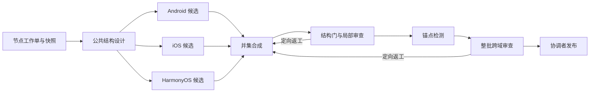

# 节点研究工作流 v1

本轮从当前树重新开始。项目代码的职责是提供可重复运行的 agent 工作流；实际能力树是工作流产物。旧任务、旧执行器、旧批次和旧验收结果不参与执行。

## 目标与取舍

最高优先级是三平台能力并集的完整性、概念边界与可比较粒度。约 2,000 个能力叶子是规模预期，不是配额或覆盖分母。先形成公共结构，再核实证据，树冻结后生产知识。

标准化对象包括任务输入、agent 职责、JSON 输出、依赖图、错误分类、质量门、发布事务与追溯记录。Agent Bridge 保留为人工发起的调查/审查入口；批量工作流直接通过适配器调用 OpenCode 命名 agent，不把 Bridge 会话当作任务数据库。

## 三层职责

| 层 | 负责 | 不承担 |
| --- | --- | --- |
| Python 调度器 | 输入快照、节点归属、DAG、并发、超时、重试、断点续跑、产物归档 | 生成能力含义、判断平台等价 |
| OpenCode 标准 agent | 按输入研究、提出结构、检查语义、提交结构化结果 | 改正式树、改任务状态、自己宣布发布 |
| 确定性验收/合并器 | Schema、关系与范围检查、证据检测、审查哈希、冲突检查、正式文件事务 | 将 URL 可访问或模型自评当作事实正确 |

所有 agent 只读并返回 JSON。调度器保存返回值；只有合并器拥有正式树写入责任。OpenCode 权限用于收窄工具能力，不声称提供操作系统沙箱。

## 工作单元与并行策略

一次任务指定当前存在的 `node_id`，可以是任意深度的 branch。`depth` 表示本轮最多新增几层，不限制整棵树的终止深度。一个批次可以指定多个互不包含的节点；父子节点不能在同一批次同时派单。atomic 是已声明的终止点，重新分类必须先单独审议，v1 不自动修改已有节点含义。

每个工作单保存：协议版本、运行 ID、节点 ID、节点/祖先/子树快照、全局边界目录、比较基线、相对下钻深度、候选数预算、规则与 agent 哈希。所有阶段读取同一快照。兄弟分支可并行，同一节点先完成父级结构设计，再派发下一层；跨节点并行和三平台并行共用一个并发上限。

v1 采用**新增式下钻**：已有节点、ID、定义不变，只添加所选分支下的新节点。已有节点可作为新增节点的父级。删除、移动、合并、重命名涉及知识失效和引用迁移，必须另开结构修订单，不能夹在批量下钻结果里。

## 阶段与验收

| 阶段 / agent | 输入 | 必须交付 | 放行标准 / 失败归属 |
| --- | --- | --- | --- |
| 0. 调度器受理 | 节点列表、基线、预算 | 不可变工作单、依赖图 | 节点存在且为分支、无祖孙重叠、参数合法；错误返回调用者 |
| 1. `ft-scope` | 工作单、当前边界 | 切分轴、候选分组、排除项、邻域边界、待核问题 | 先设计 L2/L3；分组由能力任务定义，不能照搬 SDK 目录 |
| 2. `ft-android` / `ft-ios` / `ft-harmonyos` | 工作单、结构草案 | 本端候选、具体 API 锚点、公开性/设备/发行版条件、检索轨迹、缺口 | 三端均返回可验结构；未找到必须记录未知，不能认定不支持 |
| 3. `ft-synthesize` | 草案、三端候选、已有子树 | 完整新增节点记录、每项候选去向、边界决策、终止/继续下钻理由、缺口 | 每项候选明确 adopted / duplicate / out_of_scope / deferred；单端独有不能无理由遗漏 |
| 4. 确定性结构门 | 新增节点 + 全树快照 | 结构错误和警告 | Schema、唯一 ID、父级/深度、无环、范围归属、知识路径、引用、兄弟切分轴全部通过 |
| 5. `ft-review` | 原始工作单、候选、结构、机器报告 | 按检查项的独立审查、节点级问题、pass / revise | 检查覆盖线索、同级切分轴、互斥、粒度、命名、停止理由、三端候选处置；pass 不能带 blocking 问题 |
| 6. 锚点检测器 | 已过结构门的候选、官方语料快照 | 每个 binding 的结果、正文哈希、来源路径、失败原因 | 只检测锚点，保留失败节点；不改变结构，也不推断平台支持 |
| 7. `ft-integrate` | 所有节点提案、全树边界、局部审查、锚点报告 | 跨域重复/边界/引用审查、pass / revise | 全局审查绑定整批候选哈希；局部通过不能替代全局通过 |
| 8. 合并器 | 全部通过的产物与发布计划 | 正式 YAML、未知知识空壳、发布回执 | 当前树与输入快照相符、产物哈希完整；事务内复查，不覆盖其他人的更改 |

三平台研究用于补齐设计候选和 API 锚点，不在这里生产大段平台知识。每个新节点至少一端有具体符号和官方 URL；符号文字命中仅是机器检测等级，公开可调用性与适用范围仍需审查。范围内可仅在平板/手表等设备存在的能力保留并注明设备。

## 统一产物契约

契约位于 `config/workflow/`，由调度器在每次调用时附入输入包。所有 agent 输出一个 JSON 对象，不写文件，不包裹解释性文字。

- 公共信封：`schema_version`、`task_id`、`input_hash`、`stage`、`payload`。哈希由输入给出，必须原样回传。
- scope：`axis`、`groups`（名称/定义）、`boundaries`、`questions`。
- 平台候选：稳定的批内 candidate ID、名称/定义、binding、distribution、device_forms、conditions、public_api、线索理由；附 queries 和 gaps。
- synthesis：完整 feature Schema 节点、candidate disposition、每个节点的继续/停止理由、未解决问题。
- review / integrate：受审输入哈希、verdict、具名 checks（pass/issue + 理由）、issues（节点、code、severity、修复建议）。失败产物也永久保存。

所有候选是未确认设计输入。默认 `anchor_status: unverified`，模型不得给自己写 symbol_ok。发布阶段使用独立检测结果，不把模型输出当检测结果。

## 执行、重试与返工

任务状态是 `pending → running → succeeded / failed / blocked`。依赖失败时下游不执行。网络/进程/格式/契约失败按 max_attempts 有界重试；成功产物复用，不为恢复一个失败节点重跑全树。进程崩溃后，下一次获得运行锁的调度器把遗留 running 作为中断尝试记录，再继续。

语义审查 revise 不做无上限自动对话。`revise` 命令把失败审查与原提案传回 synthesis，重跑 synthesis → 局部审查 → 检测 → 全局审查；其他节点成功阶段复用。全局边界问题涉及几个节点就显式返工几个节点。配置限制每个节点的返工轮数。基础设施失败修复后用 `retry` 追加有限尝试，不清除历史。

一个运行只允许一个调度器写状态，内部用线程池管理独立 OpenCode 进程。不同运行可研究同一树快照；发布串行，并拒绝过期快照。v1 过期后重新 plan，避免未经复审的自动 rebase。单机文件锁适用于共享本地目录；v1 不提供跨机器远程结果导入，不能把本地文件锁当作分布式租约。

每次尝试保留输入、原始事件、stderr、session ID、模型参数、耗时、token/cost（后端提供时）、结果与错误。不存在跨运行的隐式模型缓存；同运行只有输入和产物哈希一致的成功结果可复用。规则/agent 更新后旧运行拒绝继续，需新建运行。

## 正式写入与恢复

`run` 只产出候选。`report` 汇总状态与可发布性。`publish` 是协调者发起的本地合并动作，不是平台知识确认，也不是树冻结。

合并器持有全局发布锁，重新验收并形成文件 before/after 事务日志；每个文件原子替换。中断后再次 publish 仅接受文件仍为 before 或已经是 after，继续完成事务。若出现第三种内容则停止并报告冲突。事务完成后写回执，重复发布幂等。读者可能在跨文件事务中短暂读到中间状态，完成后再刷新看板；此方案不声称跨文件原子可见。

保留已有知识内容，仅为新节点补未知 stub，并更新已有 rollup 的导航 child_index。树设计过程中的待展开 branch 是有效中间状态，以待下钻清单表达，不能计入 atomic 叶子，也不能通过冻结门。

## 准确性和效率分别度量

准确性报告：新增节点/分支/atomic 数、未展开分支、缺失锚点、检测失败、未处置候选、局部/跨域阻断问题、基线未知项。任务成功、下载数量、Schema 通过均不等于树覆盖完整。

效率报告：成功/失败/等待任务数、尝试次数、复用阶段、墙钟时间、后端 token/cost。默认每次只新增 1–2 层，设置每节点候选数量预算防止单次上下文爆炸；达到预算必须报告 deferred 和进一步拆单建议，不能静默截断。优先本地全文检索，需要时读取官方正文。

新一轮真实研究需逐平台核实启动日最新正式版，固定 release、SDK、设备、来源与日期。允许用 `unknown` 基线研究设计，但报告醒目标示，不能用于冻结或确认知识。

## 树冻结后的独立流程

冻结是全树发布后的独立里程碑：所有域覆盖审查、未展开分支处置、跨域去重、锚点缺口裁决、版本核实、历史 ID 去向核对都完成，形成绑定树哈希的验收记录。不能用某一个批次 pass 自动冻结整树。

后续知识流水线的工作单为 `冻结树哈希 × node_id × platform × baseline`，依次为官方证据研究、单端断言审查、三端比较、置信度/真机需求评估、知识合并。按现有 research-runbook 与 knowledge-confidence 规则生产；树发生变化后按 subject_hash 失效。本次 v1 实现范围是树工作流，CLI 不派发知识任务，防止树未冻结时启动正文生产。

## OpenCode 对接依据

使用官方支持的[项目级 Markdown agents](https://opencode.ai/docs/agents/)，并用 [CLI](https://opencode.ai/docs/cli/) 的 `run --agent NAME --format json` 启动独立会话。agent [权限](https://opencode.ai/docs/permissions/)默认拒绝，仅开放阅读、检索、官方网页获取；禁止编辑、shell、嵌套派单与交互提问。运行器把本地候选资料和输出 Schema 放入输入，批次调度集中管理。模型与 variant 由运行参数固定；省略时继承用户 OpenCode 默认配置，不在 agent 文件硬编码供应商。
